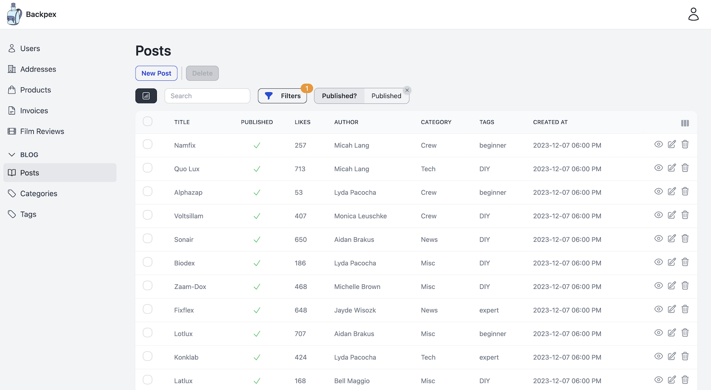

# Backpex

Backpex is a simple admin dashboard that makes it easy to manage existing resources in your application.

See our comprehensive [docs](https://hexdocs.pm/backpex) for more information.

## Screenshot ([Live Demo](https://backpex.live/admin/users))

## Development

### Requirements

- [Docker](https://www.docker.com/)

### Recommended Extensions

- [Editorconfig](http://editorconfig.org)
- [JavaScript Standard Style](https://github.com/standard/standard#are-there-text-editor-plugins)

### Setup

- Clone the repository.
- In `demo` directory run `cp .env.example .env` and set values accordingly.
  - Generate `SECRET_KEY_BASE` via `mix phx.gen.secret`.
  - Generate `LIVE_VIEW_SIGNING_SALT` via `mix phx.gen.secret 32`.
- Run `docker compose up` (`yarn watch` is triggered automatically).
- Run `mix dialyzer --plt` inside the `app` container to generate the initial PLT file.

Now you can visit [`localhost:4000`](http://localhost:4000) from your browser.

## License

Backpex source code is licensed under the [MIT License](LICENSE.md).
